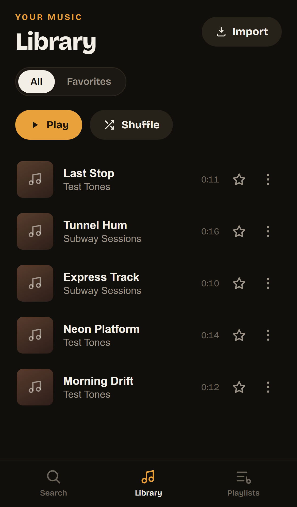
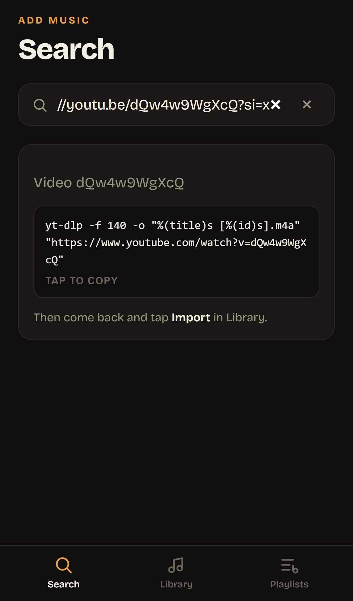
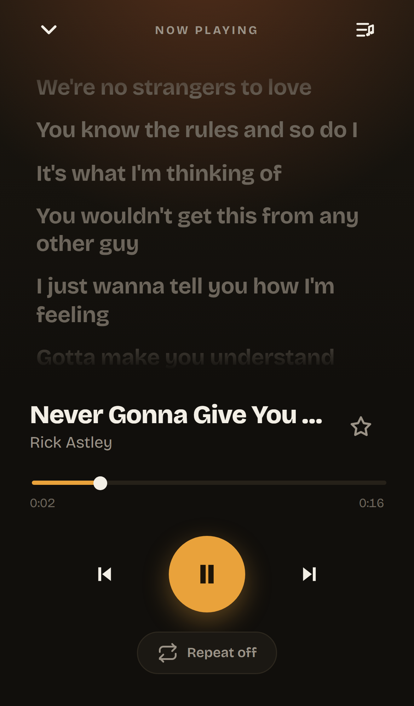

<div align="center">

# 🎧 Melody

**A personal, offline-first music player for iPhone. Built because the NYC subway has terrible wifi.**

Paste a YouTube link, download the audio on-device, and play it locally with cover art, synced lyrics, playlists, and lock-screen controls. No account, no streaming, no app store. Just a web app you add to your home screen.

</div>

---

## Why this exists

I wanted Spotify-style convenience for music I already know I want, that keeps playing underground where streaming apps choke. The catch: a web app **can't** download YouTube audio (signed URLs and CORS get in the way), and iOS **can't** run a downloader inside a browser. So Melody splits the work across three pieces that hand off to each other. Figuring out that hand-off was most of the fun.

> **Note:** This is a personal project for my own offline listening. It is not for distribution, and you're responsible for respecting YouTube's Terms of Service and copyright where you live.

## Screenshots

| Library | Add via YouTube link | Synced lyrics |
|:---:|:---:|:---:|
|  |  |  |

## Features

- 📥 **Add by YouTube link**: paste a share link; Melody recognizes it and hands you a ready-to-run download command.
- 💾 **Fully offline**: audio is stored on-device (IndexedDB) and plays with no network.
- 🎵 **Real player**: play/pause, scrub, next/prev, and three loop modes (off, repeat-all, repeat-one).
- ⭐ **Favorites and playlists**: star tracks, build playlists, reorder, shuffle.
- 🖼️ **Cover art**: pulled from the YouTube thumbnail and cached for offline.
- 🎤 **Synced lyrics**: fetched from [LRCLIB](https://lrclib.net), highlighted line-by-line as the song plays, cached for offline. One tap to re-search if a match is off.
- 🔒 **Lock-screen controls and background audio** via the Media Session API.
- 🔎 **Fuzzy search** over your local library.
- 📱 **Installable PWA**: Add to Home Screen and it runs fullscreen like a native app.

## How it works

A browser can't download YouTube audio or run yt-dlp, so the work is split:

```
┌─────────────────────────────┐     paste link, get command      ┌──────────────────────────┐
│  Melody (PWA in Safari)     │ ───────────────────────────────▶ │  a-Shell + yt-dlp        │
│  • search / link detection  │                                   │  (Python terminal app,    │
│  • player, playlists, lyrics│                                   │   downloads m4a on-device)│
│  • IndexedDB (audio + meta) │ ◀─────────────────────────────── │                          │
└─────────────────────────────┘      import the downloaded file   └──────────────────────────┘
```

- **Melody (PWA)** — everything you see and feel. ~90% of the code. React + Vite.
- **a-Shell + yt-dlp** — a free on-device terminal that actually downloads the audio (no server, no datacenter IP getting bot-blocked).
- **IndexedDB** — imported audio bytes + the catalog, playlists, favorites, and cached lyrics all live locally.

iOS has no File System Access API, so audio is **imported once via the file picker into IndexedDB**, then played back from an object URL — which is why it survives offline.

## Tech stack

| | |
|---|---|
| Framework | React + Vite |
| PWA / offline | `vite-plugin-pwa` (Workbox service worker) |
| Local storage | Dexie (IndexedDB) + `dexie-react-hooks` |
| Search | Fuse.js |
| Lyrics | LRCLIB (free, no key) |
| Type / font | Bricolage Grotesque (self-hosted) |
| Hosting | Firebase Hosting |

## Run it locally

```bash
git clone https://github.com/EnesYilmazcode/Melody.git
cd Melody
npm install
npm run dev          # http://localhost:5173
```

In dev, the library is seeded with a few sample tones (`scripts/make-samples.mjs`) so there's something to play. Build for production with:

```bash
npm run build
```

## Adding a song (the download flow)

You'll need the free [**a-Shell**](https://holzschu.github.io/a-Shell_iOS/) app from the App Store, with yt-dlp installed once:

```bash
pip install yt-dlp     # run inside a-Shell, one time
```

Then, for each song:

1. In the YouTube app: **Share → Copy Link**.
2. In Melody → **Search** → tap the **paste** icon. It detects the link and **copies a download command** to your clipboard.
3. Switch to **a-Shell**, paste, and run — it downloads the `.m4a`.
4. Back in Melody → **Library → Import** → pick the file from **On My iPhone → a-Shell**.

That's it: the song is now in your library with cover art and lyrics, playable offline forever.

> yt-dlp occasionally breaks when YouTube changes things — fix with `pip install -U yt-dlp`.

## Known iOS limitations (by design)

- Background audio stops if you **force-quit** the PWA (fine for screen-off-in-pocket listening).
- The home-screen icon is cached by iOS — to refresh it after changes, remove and re-add the app.

## Project layout

```
src/
  components/   UI (player, views, sheets, modals, track rows)
  state/        PlayerProvider, UIProvider, library hooks
  lib/          db (Dexie), lyrics (LRCLIB), youtube link parsing, audio helpers
scripts/        sample generation, screenshot harness, deploy helper
```

---

<div align="center">
Built with care for the B train. 🚇
</div>
